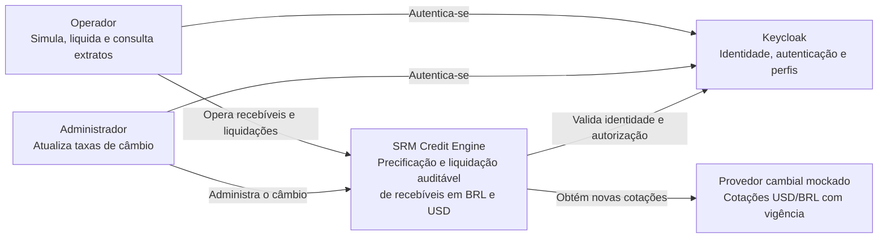
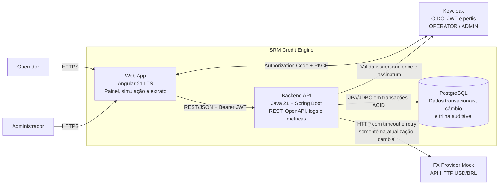
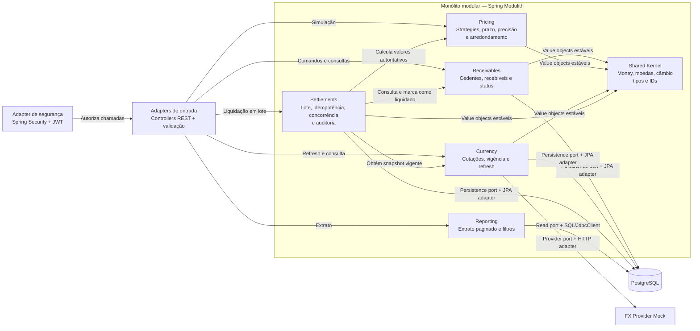
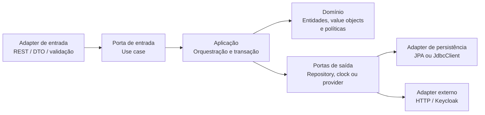

# Arquitetura do SRM Credit Engine

Este documento apresenta a arquitetura planejada para a entrega Sênior. Os diagramas usam a notação C4 nos níveis de contexto e contêiner e detalham, em seguida, os módulos e as fronteiras hexagonais do backend.

## C4 — Nível 1: contexto do sistema

## C4 — Nível 2: contêineres

### Responsabilidades dos contêineres

- O Angular mantém o token apenas durante a sessão, aplica guards por perfil e nunca calcula valores financeiros autoritativos.
- O backend recalcula todas as simulações e liquidações, valida o JWT e concentra as regras de negócio.
- O PostgreSQL assegura constraints, idempotência, locking otimista e registros imutáveis de liquidação.
- O Keycloak administra usuários e credenciais; o motor de crédito consome somente identidade e perfis.
- O provedor mockado é chamado no refresh de câmbio. A liquidação usa apenas taxas vigentes já persistidas.

## Backend — módulos e dependências permitidas

As setas entre módulos representam as únicas dependências síncronas permitidas. O `shared` é um shared kernel mínimo e estável, limitado a value objects financeiros, vocabulário comum e IDs tipados; ele não contém regra de orquestração nem depende dos módulos de negócio. Cada módulo expõe sua API de aplicação e mantém domínio, portas e adapters internos encapsulados. O módulo `settlements` orquestra a liquidação, mas não acessa entidades ou repositories internos de outros módulos. `reporting` é um read model e pode consultar o banco diretamente com SQL otimizado, sem reutilizar aggregates transacionais.

## Estrutura hexagonal aplicada por módulo

### Regras arquiteturais

1. O domínio não depende de Spring, HTTP, JPA, banco ou Keycloak.
2. Adapters dependem das portas; portas não dependem dos adapters.
3. Controllers convertem DTOs e delegam ao caso de uso, sem conter regra financeira.
4. Transações são delimitadas na camada de aplicação, uma por item da liquidação em lote.
5. Dependências entre módulos passam apenas por APIs públicas verificadas pelo Spring Modulith.
6. O motor financeiro usa `BigDecimal`; arredondamento e conversão seguem o `SPEC.md`.
7. Logs estruturados, correlation ID e métricas atravessam as fronteiras como preocupações operacionais, sem contaminar o domínio.
